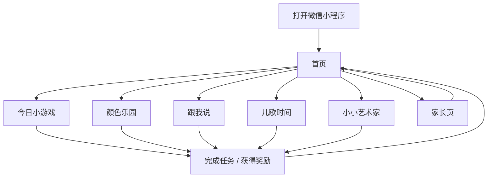
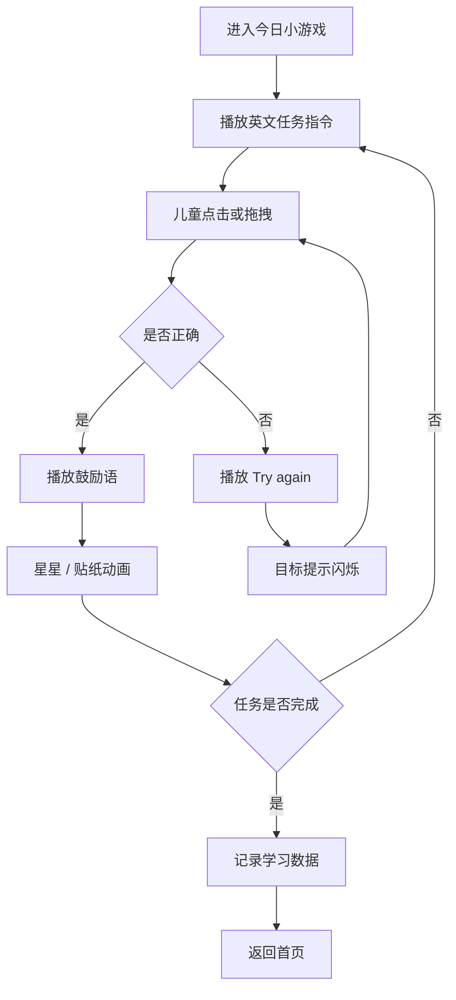
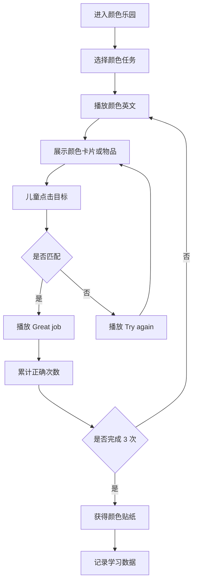
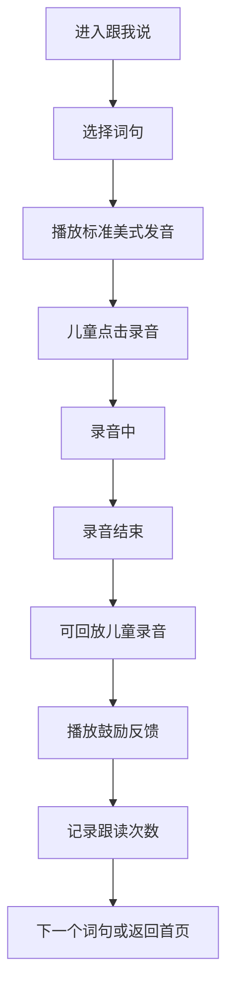
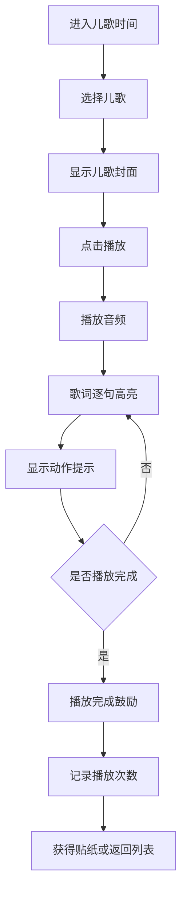
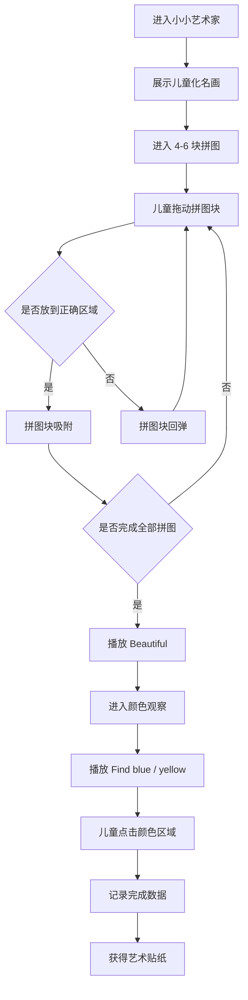

# 儿童英语启蒙微信小程序页面原型与功能流程图

## 1. 产品首页

定位：3-6 岁儿童进入小程序后的主操作台，重点是可爱、直观、少文字。

### 页面结构

```text
┌──────────────────────────┐
│ 顶部：儿童头像 / 今日贴纸 / 家长入口 │
├──────────────────────────┤
│ 欢迎角色区：卡通伙伴 + 今日鼓励语   │
│ 例：Hello! Let's play!             │
├──────────────────────────┤
│ 今日小游戏 大入口                  │
│ 今日主题：Colors / Animals / Song  │
├──────────────┬──────────────┤
│ 颜色乐园      │ 跟我说        │
├──────────────┼──────────────┤
│ 儿歌时间      │ 小小艺术家    │
└──────────────────────────┘
```

### 关键元素

- 顶部儿童头像：展示昵称或默认卡通头像
- 今日贴纸：显示今天可获得的奖励
- 家长入口：放右上角，视觉弱化
- 四个大入口：使用大图标和卡通角色，不依赖长文字

### 交互

- 点击任一入口进入对应模块
- 首页角色可点击，播放一句英文问候
- 完成任务后回到首页，贴纸或星星数量更新

---

## 2. 今日小游戏页

定位：每天 1 个 1-3 分钟的小任务，帮助儿童形成每日打开习惯。

### 页面结构

```text
┌──────────────────────────┐
│ 返回按钮        今日小游戏 │
├──────────────────────────┤
│ 卡通角色给出语音指令       │
│ 例：Tap red!              │
├──────────────────────────┤
│ 大图互动区                 │
│ 红气球 / 蓝气球 / 黄气球    │
├──────────────────────────┤
│ 反馈区：星星 / 动画 / 鼓励语 │
└──────────────────────────┘
```

### 首版玩法

- 听英文点颜色
- 听英文点动物
- 听英文点水果
- 拖动物品到篮子或角色旁边

### 状态

- 初始：播放任务语音
- 正确：播放 `Great job!`，出现星星动画
- 错误：播放 `Try again!`，目标轻微闪烁
- 完成：获得贴纸，返回首页或进入下一个任务

---

## 3. 颜色乐园页

定位：基础颜色认知 + 英文颜色输入。

### 页面结构

```text
┌──────────────────────────┐
│ 返回按钮          颜色乐园 │
├──────────────────────────┤
│ 语音按钮：Listen           │
│ 当前指令：red / blue / ... │
├──────────────────────────┤
│ 颜色卡片网格               │
│ red     blue    yellow     │
│ green   pink    purple     │
├──────────────────────────┤
│ 小任务区：Find red!        │
│ 奖励进度：★ ★ ☆            │
└──────────────────────────┘
```

### 首版内容

- `red`
- `blue`
- `yellow`
- `green`
- `pink`
- `purple`

### 玩法

- 点击颜色卡片播放英文
- 听英文选择颜色
- 从物品中找颜色，例如 red apple、yellow banana
- 完成 3 次正确选择获得一个颜色贴纸

---

## 4. 跟我说页

定位：简单美语跟读，不做复杂评分，先让儿童敢听、敢模仿。

### 页面结构

```text
┌──────────────────────────┐
│ 返回按钮          跟我说   │
├──────────────────────────┤
│ 卡通角色 / 口型动画        │
│ 当前词句：Hello            │
├──────────────────────────┤
│ 播放原音按钮               │
│ 大录音按钮                 │
│ 回放按钮                   │
├──────────────────────────┤
│ 鼓励反馈：You did it!      │
└──────────────────────────┘
```

### 首版词句

- `Hello`
- `Bye-bye`
- `Good morning`
- `Thank you`
- `red`
- `apple`

### 交互

- 点击播放原音
- 长按或点击录音按钮进行跟读
- 录音结束后可回放
- 不做分数，只给鼓励反馈

---

## 5. 儿歌时间页

定位：英文儿歌播放、跟唱和动作模仿。

### 页面结构

```text
┌──────────────────────────┐
│ 返回按钮          儿歌时间 │
├──────────────────────────┤
│ 儿歌封面 / 卡通场景        │
│ 当前儿歌：ABC Song         │
├──────────────────────────┤
│ 播放 / 暂停按钮            │
│ 歌词高亮区                 │
│ A B C D E F G             │
├──────────────────────────┤
│ 动作提示：Clap! / Jump!    │
└──────────────────────────┘
```

### 首版儿歌

- `ABC Song`
- `Twinkle Twinkle Little Star`
- `If You're Happy`

### 功能

- 播放 / 暂停
- 歌词逐句高亮
- 动作提示
- 播放完成后给贴纸奖励

---

## 6. 小小艺术家页

定位：名画简单拼图 + 色彩观察。

### 页面结构

```text
┌──────────────────────────┐
│ 返回按钮        小小艺术家 │
├──────────────────────────┤
│ 今日作品：Starry Night     │
│ 低幼化名画预览             │
├──────────────────────────┤
│ 拼图区域                   │
│ 4-6 块大拼图               │
├──────────────────────────┤
│ 色彩任务：Find blue!       │
│ 完成反馈：Beautiful!       │
└──────────────────────────┘
```

### 首版内容

- 儿童化《星月夜》拼图
- 拼图块数：4-6 块
- 颜色任务：`blue`、`yellow`
- 看图短句：`I see stars.`

### 交互

- 拖动拼图块到正确位置
- 拼图块靠近正确位置时自动吸附
- 完成后播放鼓励语
- 进入颜色观察：听英文找颜色

---

## 7. 家长页

定位：给家长查看学习情况，不进入儿童主流程。

### 页面结构

```text
┌──────────────────────────┐
│ 返回按钮          家长中心 │
├──────────────────────────┤
│ 今日学习时长：6 分钟       │
│ 今日完成任务：3 个         │
├──────────────────────────┤
│ 听过的单词                 │
│ red / blue / apple / dog   │
├──────────────────────────┤
│ 儿歌播放记录               │
│ ABC Song 1 次              │
├──────────────────────────┤
│ 跟读次数：4 次             │
└──────────────────────────┘
```

### 首版功能

- 今日学习时长
- 今日完成任务
- 听过的单词
- 儿歌播放记录
- 跟读次数

---

## 8. 总导航流程图



---

## 9. 今日小游戏流程图



---

## 10. 颜色乐园流程图



---

## 11. 跟我说流程图



---

## 12. 儿歌时间流程图



---

## 13. 小小艺术家流程图



---

## 14. 首版开发优先级

## 14. IP 元素融入方案

可在首版原型中加入少量“授权 IP 主题池”，帮助产品更贴近宝宝熟悉的内容，但正式上线前必须确认授权。当前原型只表达内容方向，不直接绘制或复刻具体角色形象。

这些主题不作为首页菜单逐个展示。儿童只看到“今日小游戏”或“惊喜任务”入口，点击后系统随机抽取一个主题玩法，例如词汇、冰雪、救援、颜色或儿歌。这样可以保持新鲜感，也避免首页信息过多。

### Yakka Dee 词汇感

适合放在“跟我说”和“今日小游戏”中：

- 单词重复，例如 `apple, apple, apple`
- 夸张口型动画
- 节奏化发音
- 重点强化儿童听音和模仿

### 冰雪主题 / 爱莎方向

适合放在“颜色乐园”和“儿歌时间”中：

- 雪花、蓝色、闪光、城堡氛围
- 关联词汇：`blue`、`white`、`snow`、`sparkle`
- 儿歌可做冰雪氛围原创儿歌，不使用原曲歌词

### 汪汪队任务感

适合放在“今日小游戏”中：

- 救援任务式引导
- 听英文找颜色、找水果、送物品
- 完成后获得任务徽章或贴纸
- 强化目标感和完成感

### 版权边界

- Yakka Dee、冰雪奇缘/爱莎、汪汪队均属于第三方 IP
- 原型阶段可以作为参考方向和占位模块
- 商业上线前需取得授权，或改为原创角色与原创主题

---

## 15. 趣味性与难度递进

### 趣味性设计

产品要避免做成“课程表”，更像 3-6 岁儿童每天愿意打开的小小英文乐园。

- 角色陪伴：卡通伙伴负责打招呼、发任务、鼓励完成
- 短任务循环：每个任务控制在 1-3 分钟
- 即时反馈：点击后立刻有声音、动画、星星或贴纸
- 主题惊喜：颜色、儿歌、冰雪、救援、名画拼图轮换出现
- 允许试错：错误只提示 `Try again!`，不扣分、不批评
- 亲子共玩：家长可陪孩子一起拍手、找颜色、拼图、跟读

### 年龄分层

同一套页面不拆成复杂菜单，系统根据年龄或家长选择的模式，调整任务目标、选项数量和表达要求。

| 年龄 | 主要目标 | 任务设计 |
| --- | --- | --- |
| 3-4 岁 | 听音、点击、观察 | 2-3 个选项，听单词点图片或颜色，不要求完整表达 |
| 4-5 岁 | 跟读、配对、词组 | 3-4 个选项，加入 `red apple`、动物叫声配对、录音回放 |
| 5-6 岁 | 短句、组合、挑战 | 加入 `I see...`、`I like...`、6-9 块拼图、儿歌动作排序 |

### 难度递进

难度递进不靠增加文字和考试，而是慢慢增加听辨、操作、表达和组合能力。

1. 听一听
   - 点击角色或物品，听英文发音
   - 目标：熟悉英语声音

2. 点一点
   - 听 `red` 点红色，听 `apple` 点苹果
   - 目标：建立声音和图像对应

3. 说一说
   - 跟读 `Hello`、`red`、`apple`
   - 支持录音回放，只鼓励不评分
   - 目标：愿意开口模仿

4. 玩组合
   - `red apple`
   - `I see stars.`
   - 拼图后找颜色
   - 儿歌跟唱加动作
   - 目标：把词汇、颜色、动作和场景组合起来

---

## 16. 首版开发优先级

### P0 必做

- 首页
- 今日小游戏
- 颜色乐园
- 儿歌时间
- 小小艺术家基础拼图
- 家长页学习记录
- 点击发音
- 基础奖励反馈

### P1 可做

- 跟我说录音回放
- 歌词高亮
- 拼图吸附动画
- 贴纸奖励册的基础展示

### 暂不做

- AI 口语评分
- 复杂课程体系
- 排行榜
- 社交分享
- 会员付费
- 大规模后台管理
